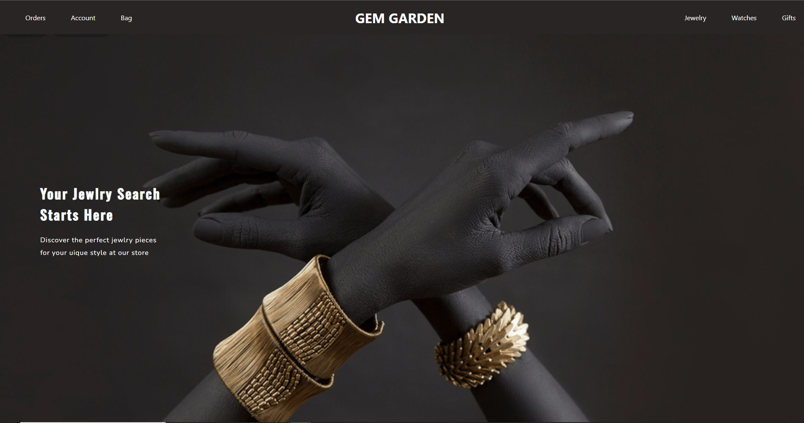
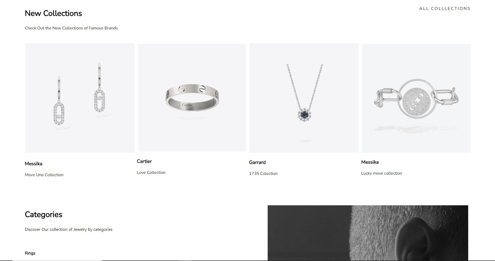
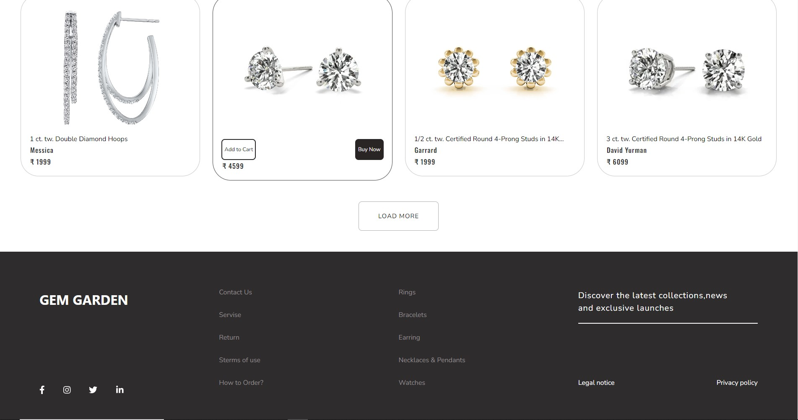
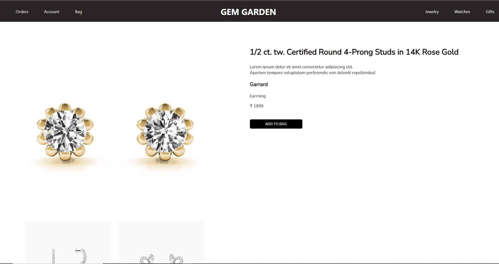
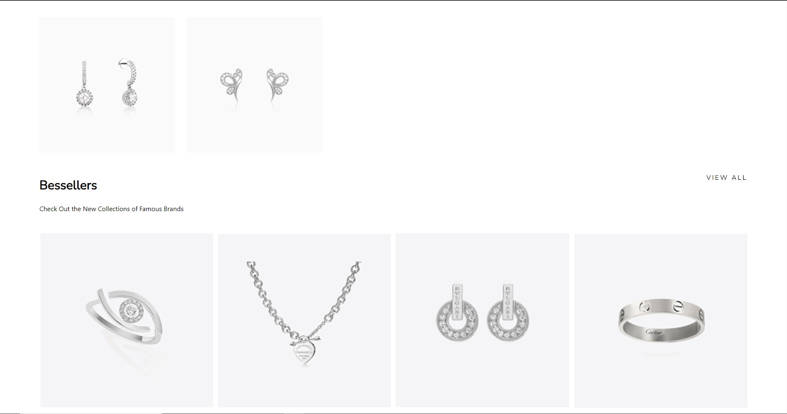
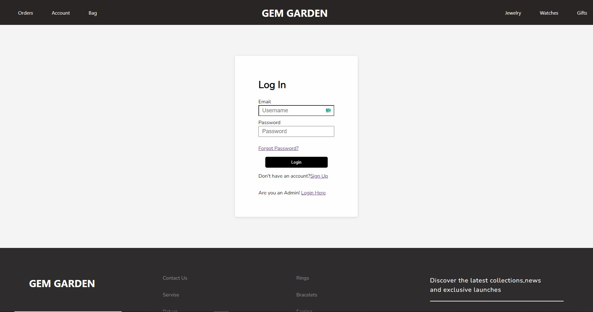
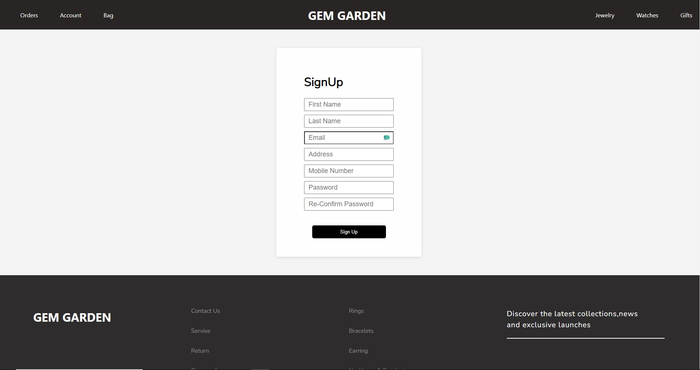
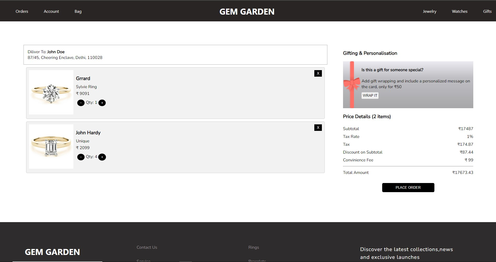
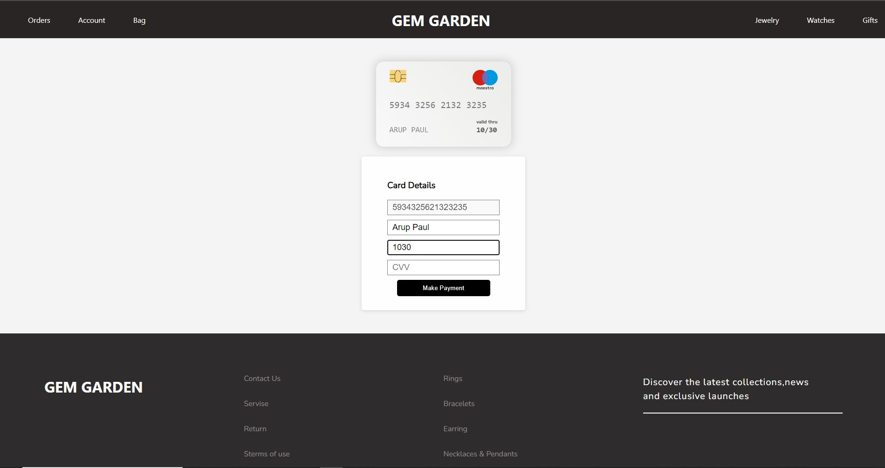
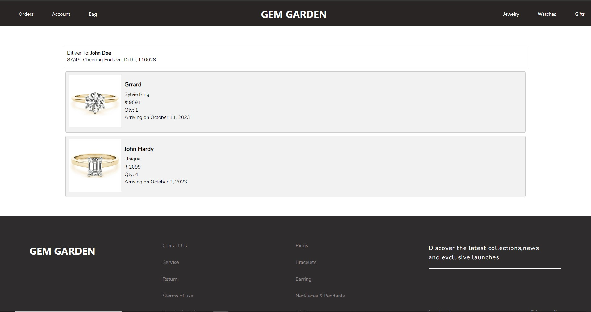

# festive-crayon-1023

# GEM GARDEN

Welcome to GEM GARDEN, your premier destination for exquisite designer jewelry! Our e-commerce website is designed to provide an unparalleled shopping experience for jewelry enthusiasts of all tastes. Whether you're searching for timeless classics or the latest in contemporary designs, GEM GARDEN has it all.


## Home Page
Our Home Page is the gateway to a world of exquisite designer jewelry. Discover our most popular products, featured prominently, and navigate effortlessly with our user-friendly Navbar. Explore our New Collection to stay updated with the latest trends. Our Footer provides quick access to essential links and information, ensuring a seamless browsing experience.


## Screenshots


## ScreenShots


## Screenshots


## Product Page

The heart of GEM GARDEN, the Product Page, showcases our extensive range of jewelry. Browse through various product groups presented in visually appealing cards. Tailor your search using our comprehensive filter options to find the perfect piece that matches your style and preferences.


## ScreenShots


## ScreenShots


## Single Product Page

The Single Product Page on GEM GARDEN is where the beauty and details of each jewelry piece come to life. This page is dedicated to providing you with an in-depth look at the selected product, allowing you to make an informed and confident purchase decision.

## ScreenShots


## ScreenShots


## Account Page

Your personal space on GEM GARDEN, the Account Page, allows you to manage your profile. Here, you can conveniently log in if you're an existing member or sign up if you're new to our website. Enjoy a personalized shopping experience, track your orders, and save your favorite items for future reference.


## ScreenShots


## ScreenShots

## Cart Page

The Cart Page is where your selections come together. Review and confirm the products you've added to your cart before proceeding to checkout. It's your shopping companion, ensuring you have everything you desire before finalizing your purchase.

## ScreenShots



## Order Page

The Order Page is your window into your past transactions. View and track all your orders made on GEM GARDEN. Keep a record of your jewelry purchases, making it easy to refer back to your favorite pieces or check the status of your deliveries.

Experience the world of designer jewelry at your fingertips with GEM GARDEN's intuitive and elegant website. Each page is designed to enhance your shopping journey, ensuring you have access to the best jewelry, user-friendly navigation, and a secure, enjoyable experience.

## ScreenShots


## ScreenShots


# Tech Stack Overview
## Frontend Technologies

### React.js

Our frontend is built using React.js, a popular JavaScript library for building user interfaces. React's component-based architecture allows us to create modular and reusable UI components, making the development process efficient and maintainable.


### JavaScript (JS)

JavaScript is the foundation of our frontend development. It enables dynamic and interactive features on our website, ensuring a seamless and engaging user experience.

### CSS

Cascading Style Sheets (CSS) are used to style and format our website's layout. CSS allows us to create visually appealing designs and responsive layouts that adapt to different screen sizes and devices.

## Backend Technology

### RESTful API

Our backend relies on a RESTful API (Representational State Transfer) to handle data requests and interactions with the database. This API follows REST principles, providing a standardized and scalable approach to building web services. It enables communication between the frontend and backend, allowing users to browse products, manage accounts, view their cart, and place orders seamlessly.

## Additional Technologies

In addition to the core technologies mentioned above, we may use other tools and libraries to enhance the functionality and performance of our website. These may include:

### Authentication: 

For user authentication and security, we implement authentication mechanisms such as JWT (JSON Web Tokens) or OAuth.


### State Management:

Redux or Context API in React may be used for state management, ensuring efficient data sharing between components.

### Responsive Design: 

We follow responsive web design principles to ensure our website functions seamlessly on various devices, including desktops, tablets, and smartphones.


### Deployment: 

Vercel used for deploying and hosting the frontend and for backend components we used Render.com .

Our tech stack is carefully chosen to provide a robust, scalable, and user-friendly experience for our customers while ensuring the security and integrity of their data.

## API Reference

### Main api Link

```http
  https://gem-gardern-mock-api.onrender.com/
```
#### Get All Products

```http
  https://gem-gardern-mock-api.onrender.com/products
```

#### Get All Users

```http
  https://gem-gardern-mock-api.onrender.com/users
```


## Deployment

To deploy this project run

```bash
  npm run deploy
```

### Vercel Link 

```http
  https://gem-gardern-mock-api.onrender.com/users
```

## Installation

Install Gem Garden with npm

```bash
  npm install / npm install --legacy-peer-deps
  cd festive-crayon-1023/gem-garden
```

    
## 🔗 Links
 
 ### Sandhya Patil

[](https://github.com/patil-sandhya)

[](https://www.linkedin.com/)

 ### Arup Paul

[](https://github.com/Its-Arup)

[](https://www.linkedin.com/in/arup-paul-310270243/)

### Ashish Kumar

[](https://github.com/ashishsen003)

[](https://www.linkedin.com/in/arup-paul-310270243/)

### Sanjay Sahu
 

[](https://github.com/sanju01sahu)

[](https://www.linkedin.com/in/arup-paul-310270243/)

### Richa Singh
 

[](https://github.com/Richasi)

[](https://www.linkedin.com/in/arup-paul-310270243/)


